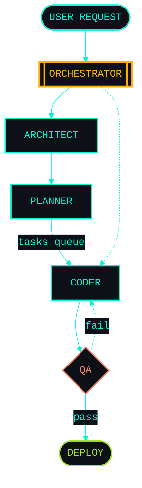

<!-- ══════════════════════════════════════════════════════════════════════ -->
<!--          ◢◤  THITIWUT // MISSION CONTROL  ◥◣  v8.0.2026                -->
<!-- ══════════════════════════════════════════════════════════════════════ -->

<div align="center">


<a href="https://git.io/typing-svg">
  

</div>

<!-- ══════════════════════════════════════════════════════════════════════ -->
<!--                          IDENTITY BANNER                                -->
<!-- ══════════════════════════════════════════════════════════════════════ -->

```


   ████████╗██╗  ██╗██╗████████╗██╗██╗    ██╗██╗   ██╗████████╗
   ╚══██╔══╝██║  ██║██║╚══██╔══╝██║██║    ██║██║   ██║╚══██╔══╝
      ██║   ███████║██║   ██║   ██║██║ █╗ ██║██║   ██║   ██║
      ██║   ██╔══██║██║   ██║   ██║██║███╗██║██║   ██║   ██║
      ██║   ██║  ██║██║   ██║   ██║╚███╔███╔╝╚██████╔╝   ██║
      ╚═╝   ╚═╝  ╚═╝╚═╝   ╚═╝   ╚═╝ ╚══╝╚══╝  ╚═════╝    ╚═╝

         ╶─── IT Development Manager · Bangkok · 8+ yrs ───╴

         [ ONLINE ]   deploys: 98   incidents: 0   caffeine: 99%


```

<p align="center">
  
  
  
</p>

<br />

<!-- ══════════════════════════════════════════════════════════════════════ -->
<!--                            $ ./about.sh                                 -->
<!-- ══════════════════════════════════════════════════════════════════════ -->

## `> ./about.sh`

```bash

  IT Development Manager with 8+ years shipping enterprise software
  end-to-end -- problem analysis > architecture > build > deploy > watch.

  Day job    ::  securing & automating systems for SEC-regulated finance
  Night job  ::  multi-tenant SaaS · AI agents · algo trading on XAUUSD
  Why both   ::  I genuinely cannot sit still.

  -------------------- core principles --------------------

   >  ship fast, iterate honestly, automate the boring
   >  code that doesn't wake you up at 3 AM beats clever code
   >  documentation IS engineering

```

<br />

<!-- ══════════════════════════════════════════════════════════════════════ -->
<!--                    $ systemctl status modules                          -->
<!-- ══════════════════════════════════════════════════════════════════════ -->

## `> systemctl status modules`

```ini

  [ CORE RUNTIME ]
  ---------------------------------------------------------------------
   csharp.lang        v8.0+    active   ============  95%
   dotnet.core        6/7/8    active   ===========.  92%
   aspnet.mvc         legacy   active   ========....  70%
   entity.framework   cf+db1   active   =========...  80%
   angular.framework  v15+     active   ==========..  85%
   typescript.lang    v5.x     active   =========...  78%
   python.runtime     v3.11    active   =======.....  62%
   powershell.shell   v7.x     active   =======.....  60%

  [ DATA · REPORTING ]
  ---------------------------------------------------------------------
   mysql.server          active   sql + stored procedures
   rdlc.reports          active   pixel-perfect output
   stimulsoft.engine     active   enterprise reporting
   closedxml.exporter    active   xlsx generation

  [ DEVOPS · CLOUD ]
  ---------------------------------------------------------------------
   git.scm               active   trunk + feature flow
   ci.cd                 active   build > test > ship
   octopus.deploy        active   release orchestration
   rundeck.runner        active   ops automation
   azure.ad              active   enterprise SSO
   jira · slack          active   team telemetry

```

<br />

<!-- ══════════════════════════════════════════════════════════════════════ -->
<!--                       $ top -p ai_agents                                -->
<!-- ══════════════════════════════════════════════════════════════════════ -->

## `> top -p ai_agents`

```ini

   ID         ROLE              STATUS    TASKS    LATENCY    UPTIME
   ----------------------------------------------------------------------
   orch-01    Orchestrator      active       12       42ms    14d 03h
   arch-01    Architect         active        4       38ms    14d 03h
   code-01    Coder             active        8       51ms    14d 03h
   qa-01      QA                idle          0       12ms    14d 03h
   napa-pos   SaaS · POS        active        -        -      in dev
   xau-bot    Algo · XAUUSD     active       24/d     -       running

   ----------------------------------------------------------------------

   THROUGHPUT (7d)     . : | I I I |     +28% week-over-week
   TOKEN BUDGET        ================........  64% of monthly
   CLAUDE API          healthy        GEMINI API     healthy

```

<br />

<!-- ══════════════════════════════════════════════════════════════════════ -->
<!--                    $ ./architecture --diagram                           -->
<!-- ══════════════════════════════════════════════════════════════════════ -->

## `> ./architecture --diagram`



```bash

  INFRASTRUCTURE
  ---------------------------------------------------------------------
   storage     ::  redis · sqlite · supabase
   ai apis     ::  claude-api · gemini-api
   ci/cd       ::  github-actions · octopus · rundeck

```

<br />

<!-- ══════════════════════════════════════════════════════════════════════ -->
<!--                       $ ./telemetry --live                              -->
<!-- ══════════════════════════════════════════════════════════════════════ -->

## `> ./telemetry --live --include-private`

<div align="center">


<br /><br />


<br /><br />


</div>

<br />

<!-- ══════════════════════════════════════════════════════════════════════ -->
<!--                    $ git log --career --oneline                         -->
<!-- ══════════════════════════════════════════════════════════════════════ -->

## `> git log --career --oneline`

```bash

  *  2024.02   HEAD -- gmo-securities @manager-it-development
  |            >> SEC compliance · ops automation · cross-border collab
  |
  *  2022.04   it-one @web-developer
  |            >> .NET Core 6 · Angular 15 · Micro Frontend · Azure AD
  |
  *  2020.07   ayodia @web-developer-supervisor
  |            >> SCG Chemical health system · PTTEP timesheet (offshore)
  |
  *  2019.05   control-data @web-developer
  |            >> CDG/G-Able ERP · paper -> digital transformation
  |
  *  2017.07   bufftify @web-developer
  |            >> SCG group · eucalyptus volume calc · stock tracking
  |
  *  2017.06   init  rajabhat-mahasarakham/computer-engineering
               >> B.Eng. · GPA 3.18

```

<br />

<!-- ══════════════════════════════════════════════════════════════════════ -->
<!--                       $ netstat --endpoints                             -->
<!-- ══════════════════════════════════════════════════════════════════════ -->

## `> netstat --endpoints`

```bash

  PROTO    SERVICE      ENDPOINT                              STATUS
  ---------------------------------------------------------------------
  HTTPS    facebook     /AODxDEV                              open
  SMTP     email        thitiwut.natesang@gmail.com           open
  HTTPS    linkedin     /in/thitiwut-natesang                 open
  HTTPS    github       /thitiwutn                            open

```

<p align="center">
  <a href="https://www.facebook.com/AODxDEV">
    
  </a>
  <a href="mailto:thitiwut.natesang@gmail.com">
    
  </a>
  <a href="https://www.linkedin.com/in/thitiwut-natesang">
    
  </a>
  <a href="https://github.com/thitiwutn">
    
  </a>
</p>

<br />

<!-- ══════════════════════════════════════════════════════════════════════ -->
<!--                          STATUS BAR · FOOTER                            -->
<!-- ══════════════════════════════════════════════════════════════════════ -->

```bash

  STATUS:  online       UPTIME:   8y         CAFFEINE:  99%
  DEPLOYS: 98           COMMITS:  many       INCIDENTS: 0
  PACKAGES: shipping    MOOD:     building   COFFEE:    needed

```

<div align="center">


<br /><br />

<sub><i>"In production, nothing is theoretical. The system is the proof."</i></sub>

<br /><br />


</div>
